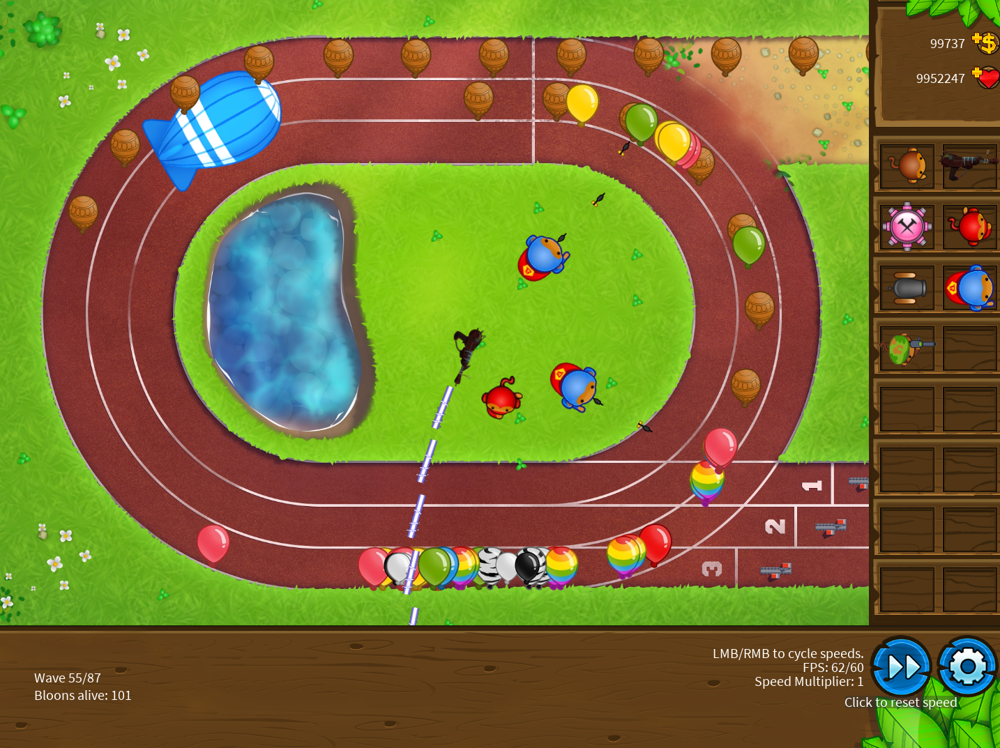
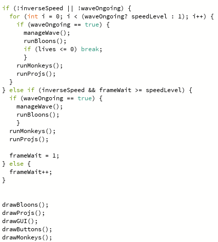
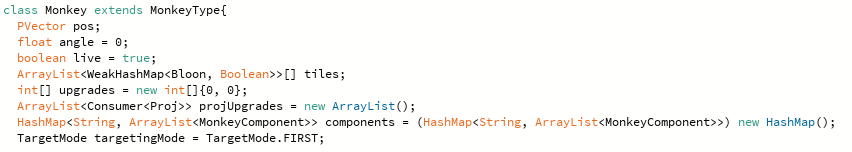
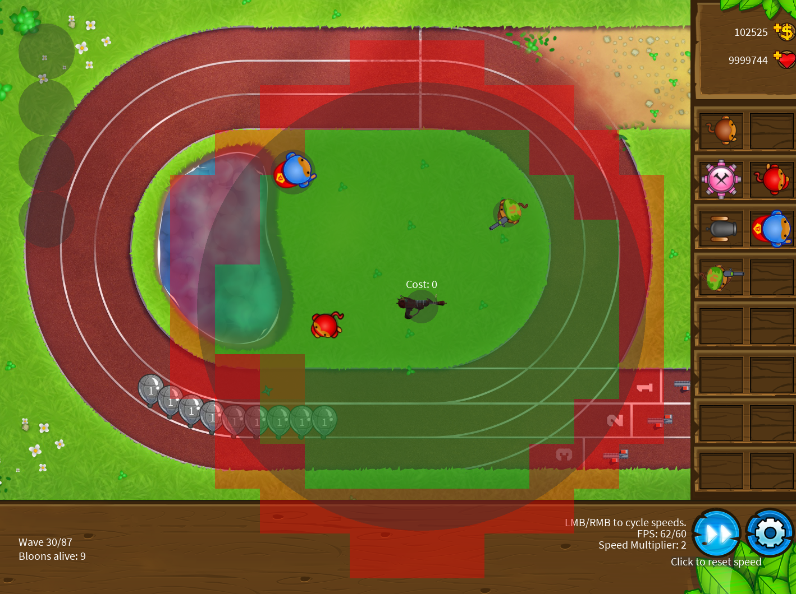
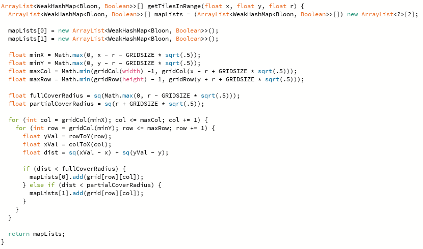
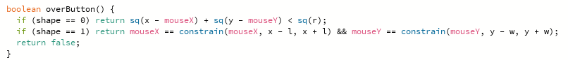
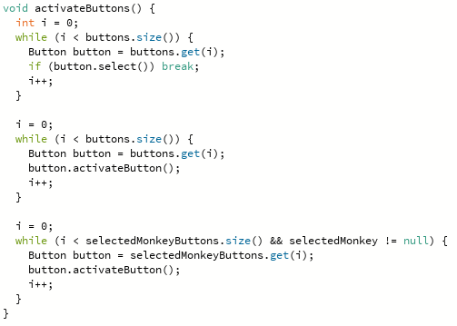
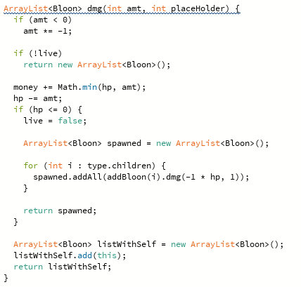
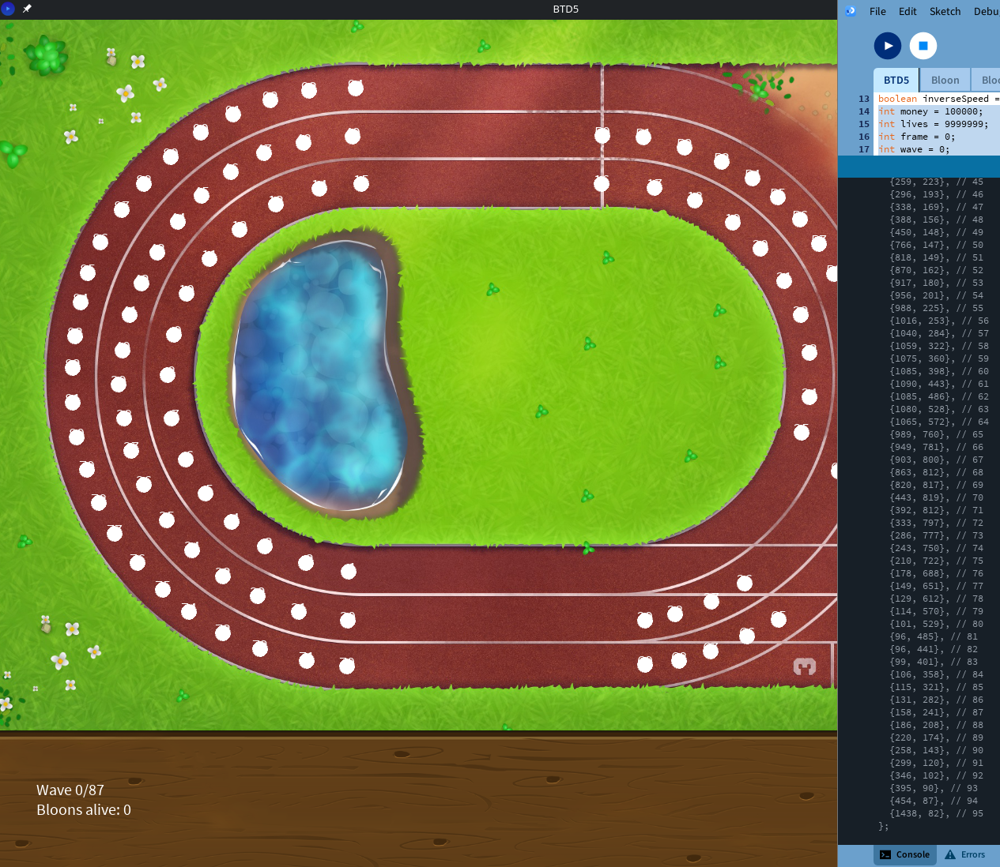
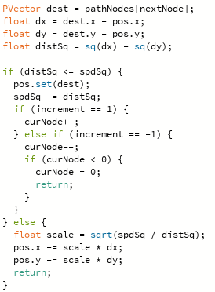

# For Review
  This is a temporary repository that will only be up for the MIT portfolio review.
## Credit
  The game concept and art belong entirely to the owner of Bloons Tower Defense 5 game, NinjaKiwi.

  The algorithms and code are inspired by the original game's mechanics but were entirely written by me.

  The programming IDE "Processing" provides a 2D graphics environment where shapes and images are made through premade functions. It also provides input/output functionality, but requires all other behaviors to be defined beyond that.
## How to Run
  An OpenJDK version17 will be required to run the code.
  Download the compressed zip listed in the releases tab.
  Extract this compressed zip and double click on the executable "BTD5" inside the folder.

  Alternatively, download the processing IDE.
  Then, clone this repo and open the program in the IDE to click the play button.

  Some debug features can be found by running the programm with the "HALP" variable set to true in the "BTD5.pde" file. This will model tiles in range, and show some buttons to summon bloons.

  Initial money and lives can be altered by editing the corresponding variables as well.

## Game Explanation

Goal:
To copy part of the tower defense games “Bloons Tower Defense 5.” I will
only add extra maps and towers if I have extra time.
I will focus on implementing the core functionality of the “fun” part of the game. (Enemy movement and mechanics) (Tower attack and progression).

Functionalities:
  Clickable GUI
  Store an array of clickableUI. Clicking on this UI allows you to spawn towers (monkeys), upgrade, or start and end the game. For example, the fast forward button will double the framerate to make the game progress faster. (Unless it crashes)

  Enemy Pathfinding and Appearance
  Enemies (Bloons) will spawn in waves, travel the path using checkpoints, and head towards the end to deplete player health. They will spawn for 85 waves (Won’t implement random waves). I will use hard coded data to spawn bloons at each wave. I already have an array of data containing this data from a past project. This will be a class. They have a unique health mechanic that will be copied from the original game.
  Tower Placement and Mechanics
     Players can spend money to create new towers (monkeys). These will use darts to pop the enemies and stop them from reaching the end. Towers can be upgraded.

Guide:
  Press the start button. Each wave of enemies will require you to press the start button to start

  Bloons: They will spawn on the start of the path after you press the start button. If they reach the end of the path, you will lose hearts until you fail at 0.

  Monkeys: The class of tower used to defend the path. Click on a monkey that you have enough money for and click on a valid area to place it. A transparent radius representing the tower’s range will appear indicating if you have met the conditions to place it. Use as much of the range as you can to cover the path.

  You will receive money for each time a tower damages an enemy or the wave ends. This money will be used to upgrade or place monkeys.

  This game ends once you complete wave 85 without depleting your hearts.

## Some features (Code is way too long to list everything)
### General Gameloop // Flexible Speed Behavior
Processing is a Java IDE that makes it easier to create programs.
Inside the draw() function, which is ran every frame in Processing, I ran the overarching game behavior. A speed variable is used to determine how many times a step is run in each frame. If inverseSpeed is triggered by the user, it instead determines how many frames pass in a single step. This allows for very variable speed changes.

Afterward, the frame that the user sees is drawn.

### General Class Structure
Many agents (bloons, monkeys, projectiles) are cloned many times. It was becoming difficult to track variables, so it was necessary to split the "type" of the agent and the individual stats of each copy into separate classes.

Here, the monkey contains variables such as upgrades and the tiles within its range. However, variables that are more static and do not change often are stored in the MonkeyType class, which the Monkey class extends.

### Hashmap Grid Space Optimization
As looping through every existing agent to check for collisions or agents in a range would be extremely taxing, I added a function to define all tiles that should be looped through instead. This alters checks from looping through all agents to a specific space. The entire map is split into a grid of tiles, and each movement recalculates the tile that an agent exists in.

This is a much needed optimization for when there are thousands of projectiles checking for collisions through thousands of balloons, when a projectile typically only needs to check the nearest 4 tiles.

Additionally, each tile is defined as fully covered by a radius, in which math is no longer required to see if an agent on the tile is in radius, or only partially covered, where math is still required to check if an agent is actually in range.

This improved the framerate in generally chaotic moments by over 5 times.

(In regards to the strange data type, each tile on the map is a WeakHashMap used as a WeakHastSet of bloons on a tile. Bloons are deleted often, so a weak dataset is preferred to not have to manage their references. Then, each tile in range is placed into one of two arraylists of fully-covered or partially-covered tiles.)

### Buttons
As buttons are not premade in Processing, I made my own Button class, which takes a Runnable (a variable containing the function) and a radius, then had the mouse loop through buttons on its position on every click.

Buttons are either shape 0 (circle) or shape 1 (rectangle).

### Bloon Damage
One of the most complex elements is the damaging of bloon agents.

Damage is converted to positive if it isn't already. Then, the status of the agent is checked because "dead" bloons are not removed until the end of a frame, which might result in projectiles colliding with soon-to-be-deleted bloons. Then, if a bloon dies, all spawned sublayers have the damage propogated to them. 

This function returns the list of all bloons hit to be added to the list of hit bloons in the projectile. This is to cause piercing projectiles to only ever hit the same target and its spawn once in its lifetime.

### Bloon Pathfinding
For defining the path that a bloon travels, I made a quick function to save nodes on a path using keybinds and manually picked successive points along the path and saved the coordinates to a hard-coded variable. 

This can be seen by enabling the DRAWING_ON variable in BTD5.pde then using 'A' to add a node, 'Q' to remove a node, and 'P' to print the results.

For movement, bloons move a specific number of units determined by the speed variable toward their destination. A loop is used to prevent undershooting or overshooting of destinations and to ensure a uniform distance is always traveled. If a bloon reaches the final node, it is deleted and counted toward the user's lives. 

The "increment" simply determines whether bloons are moving forward or backward along the track.

This is a snippet of the bloon movement code.

